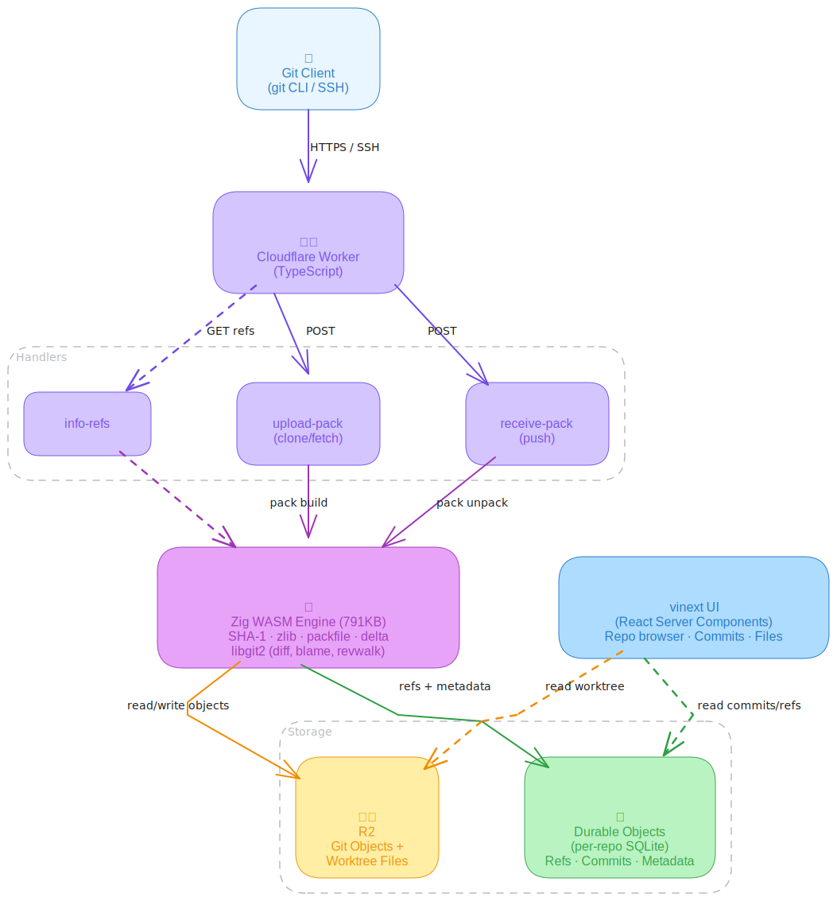

# gitmode

> **Warning: Experimental** — This project is a proof-of-concept and under active development. APIs, storage layout, and functionality may change without notice. Not recommended for production use.

Git server running entirely on Cloudflare Workers. No VMs, no servers — just Workers + R2 + Durable Objects.

The git protocol engine is written in Zig, compiled to WASM with SIMD128 acceleration for SHA-1 hashing, zlib (via libdeflate), delta compression, and packfile operations. libgit2 is statically linked for advanced operations (diff, blame, revwalk).

[](https://deploy.workers.cloudflare.com/?url=https://github.com/teamchong/gitmode)

## Deploy your own

### One-click deploy

Click the button above to:
1. Fork this repo to your GitHub
2. Connect your Cloudflare account
3. Auto-provision R2 bucket and Durable Objects
4. Deploy the Worker

### Manual deploy

```bash
git clone https://github.com/teamchong/gitmode.git
cd gitmode
./scripts/setup.sh
```

Requires: [Zig 0.15.2+](https://ziglang.org), [pnpm](https://pnpm.io), [wrangler](https://developers.cloudflare.com/workers/wrangler/)

## Usage

Once deployed, use standard git commands:

```bash
# Clone a repo
git clone https://gitmode.your-subdomain.workers.dev/alice/myproject.git

# Push to a new repo
mkdir myproject && cd myproject
git init && git add . && git commit -m "init"
git remote add origin https://gitmode.your-subdomain.workers.dev/alice/myproject.git
git push -u origin main
```

## Architecture



### Storage

| Data | Storage | Why |
|------|---------|-----|
| Git objects (blobs, trees, commits) | R2 | Bundled into ~2MB chunks, indexed via SQLite for O(1) lookups |
| Object chunk index | DO SQLite | Maps SHA → chunk key + byte offset for range reads |
| Worktree files (materialized on push) | R2 | Direct file access for UI, edge-cached |
| Refs (branches, tags, HEAD) | DO SQLite | Strongly consistent, co-located with ref update logic |
| Metadata (repos, commits, permissions) | DO SQLite | SQL queries, no cross-service latency |
| File size cache | DO SQLite | Avoids R2 reads for stats endpoint |
| Push coordination | Durable Objects | Single-threaded per repo — atomic ref updates without locks |

### Why Durable Objects with SQLite (not KV + D1)

Previous versions used KV for refs and D1 for metadata. This had problems:

- **KV eventual consistency**: After a push, `git ls-remote` could return stale refs for up to 60 seconds.
- **Cross-service latency**: Every git operation required multiple round-trips between Worker, KV, D1, and a separate DO for locking.
- **4 services to manage**: R2 + KV + D1 + DO made deployment and debugging complex.

The current architecture uses just **2 services** (R2 + DO). Each repo gets its own Durable Object with embedded SQLite. Refs, metadata, and coordination all happen in a single strongly-consistent context with zero cross-service latency.

### Why Zig WASM

Git's hot paths are CPU-bound binary operations — SHA-1 hashing, zlib decompression, delta patching, packfile assembly. Zig compiled to WASM with SIMD128 handles these 10-50x faster than JavaScript:

- **SHA-1**: Every object read/write hashes. SIMD-accelerated rounds.
- **Delta compression**: SIMD memcmp for finding copy regions in base objects.
- **Packfile parsing**: Binary protocol with varint encoding — Zig's type system maps 1:1.
- **Zlib**: Vendored libdeflate 1.25 — faster than Zig's std.compress.flate.
- **Memory**: Fixed 64MB arena allocator. No GC pauses during large pushes.

## Performance

Benchmarked on localhost dev server (wrangler dev) with R2 chunk storage, batch reads, streaming clone, and async worktree materialization:

| Metric | 100 files (796K) | 1K files (7.8MB) | 5K files (39MB) |
|---|---|---|---|
| **Push** | 182ms | 585ms | 3.4s |
| **Clone** | 107ms | 686ms | 3.1s |
| **Incremental push** | 130ms | 372ms | 867ms |
| **Stats API** | 67ms | 186ms | 447ms |
| **Files API** | 65ms | 190ms | 435ms |

Key optimizations:
- **R2 chunk storage**: Objects bundled into ~2MB R2 values with SQLite index — reduces 10K individual R2 ops to ~50 chunk reads
- **Batch readObjects**: Groups SHAs by chunk key, fetches each chunk once, extracts all objects
- **Streaming clone**: ReadableStream for sideband-wrapped packfile — 1x memory vs 3x buffered
- **Async worktree**: Large pushes (>500 objects) defer worktree materialization via `ctx.waitUntil()`, yielding between batches
- **SQLite-first lookups**: `hasObject()` checks chunk index before R2 HEAD — no round trip
- **Incremental worktree**: Diffs old tree vs new tree, only writes changed/added files
- **Optimistic object cache**: Worktree uses in-memory objects from packfile unpack, zero R2 re-reads

## Git features

| Feature | Status |
|---------|--------|
| `git clone` (HTTPS) | Supported |
| `git push` | Supported |
| `git fetch` / `git pull` | Supported |
| Branches and tags | Supported |
| Delta compression (ofs-delta, ref-delta) | Supported |
| Packfile v2 | Supported |
| Diff | Supported |
| Blame (via libgit2) | Supported |
| Commit history / log | Supported |
| REST API (29 endpoints) | Supported |
| SSH transport | Supported |
| Server-side merge (ff + 3-way) | Supported |
| Cherry-pick / revert / reset | Supported |
| Shallow clone (`--depth`) | Planned |
| Git LFS | Planned (R2 backend) |
| Protocol v2 | Planned |

## Development

```bash
# Build WASM
pnpm run build:wasm

# Run Zig tests
pnpm run test:zig

# Run integration tests
pnpm run test

# Run performance benchmarks
./test/bench.sh

# Local dev server
pnpm run dev

# Deploy
pnpm run deploy
```

## npm exports

Two tree-shakeable entry points for use as a library:

```ts
import { WasmEngine } from "gitmode/server";  // Full engine (865KB WASM) — server-side git ops
import { WasmEngine } from "gitmode/client";  // Core engine (83KB WASM) — SHA-1, zlib, delta only
```

## Project structure

```
gitmode/
├── wasm/                    Zig WASM engine
│   ├── build.zig            wasm32-wasi + SIMD128
│   └── src/
│       ├── main.zig         Server WASM exports (865KB)
│       ├── main_core.zig    Client WASM exports (83KB)
│       ├── sha1.zig         SHA-1 (SIMD-accelerated)
│       ├── object.zig       Git object format
│       ├── pack.zig         Packfile v2
│       ├── delta.zig        Delta compression
│       ├── zlib.zig         Inflate/deflate via libdeflate
│       ├── protocol.zig     pkt-line framing
│       ├── simd.zig         SIMD128 memory ops
│       └── libgit2.zig      libgit2 bindings (diff, blame, revwalk)
│   └── vendor/libdeflate/   Vendored libdeflate 1.25
├── wasm/libgit2-wasm/       libgit2 compiled to WASM
├── deps/libgit2/            libgit2 source (submodule)
├── src/
│   ├── server.ts            Server entry point (full WASM)
│   ├── client.ts            Client entry point (core WASM)
│   ├── git-engine.ts        R2 + DO SQLite orchestration (chunk storage, batch reads)
│   ├── git-porcelain.ts     High-level git ops (merge, cherry-pick, stats)
│   ├── wasm-engine.ts       Typed WASM wrapper (server)
│   ├── wasm-engine-core.ts  Typed WASM wrapper (client)
│   ├── repo-store.ts        Durable Object (per-repo SQLite)
│   ├── upload-pack.ts       Clone/fetch handler (streaming response)
│   ├── receive-pack.ts      Push handler + commit indexing + async worktree
│   ├── checkout.ts          Worktree materialization (incremental + batched)
│   ├── info-refs.ts         Ref advertisement
│   ├── packfile-builder.ts  Assemble packfiles (500-SHA batches, chunk concat)
│   ├── packfile-reader.ts   Unpack received packfiles (streaming R2 flushes)
│   ├── pkt-line.ts          Git pkt-line protocol framing
│   ├── ssh-handler.ts       SSH command parser
│   └── hex.ts               Fast hex encoding (lookup table)
├── worker/                  Cloudflare Worker entry
├── app/                     vinext UI (React Server Components)
├── test/
│   ├── gitmode.test.ts      Integration tests (87 tests)
│   ├── stress.sh            Stress test (100–10K files)
│   ├── conformance.sh       Git protocol conformance (31 tests)
│   └── bench.sh             Performance benchmarks
├── docs/                    Astro Starlight documentation
├── wrangler.jsonc           Cloudflare bindings
└── package.json
```

## License

MIT
